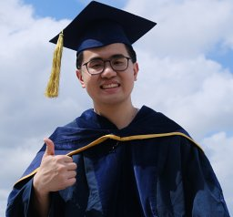
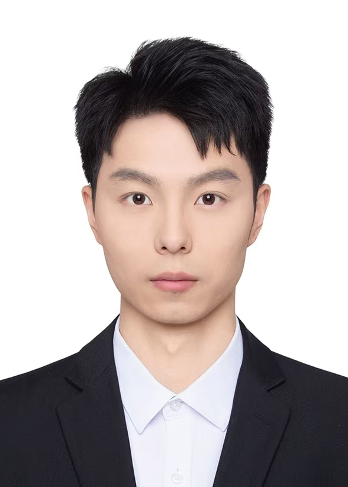
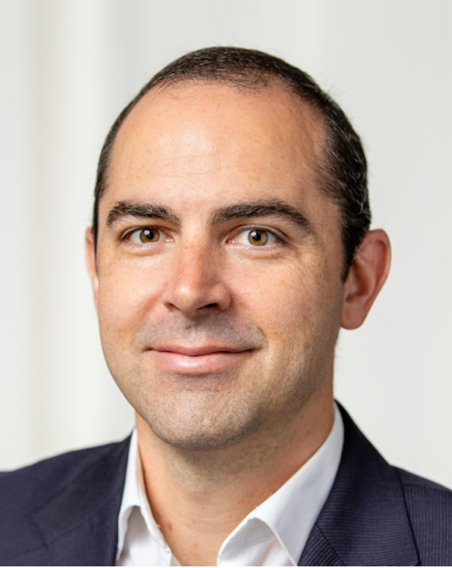

# Location

Hangzhou International Expo Center

# Important Dates

* [Event SLAM Competition](https://nail-hnu.github.io/EvSLAM/index.html)
  * Start Time: July 1, 2025
  * End Time: September 30, 2025
  * Winners announcement: October 1, 2025
* Workshop date: October 20, 2025

# Context

Event-based cameras are bio-inspired visual sensors that mimic the transient pathway of the human visual system, offering
key advantages (e.g., microsecond temporal resolution and high dynamic range) that hold the potential to revolutionize robot
state estimation and image processing. Since the first commercially available event camera in 2008 and the first Workshop on
Event-based Vision at ICRA 2017, the community has witnessed a surge in event-based/-enhanced solutions for robotics and
computer vision. However, the community is facing a chicken-and-egg dilemma: on one hand, the high price of event cameras
stifles the community growth; on the other hand, the absence of large-scale deployment of event-based solutions discourages
mass production of these cameras. To this end, this workshop is dedicated to event-based vision, with a particular focus on its
development in state estimation and image processing.

 

This workshop builds on the tradition of inviting pioneering figures in the community as speakers, while also serving as a bridge between international/domestic start-ups and academia. It aims to promote discussions on identifying roadblocks that hinder progress in the field and foster collaborative solutions to overcome these barriers. Besides, the first-ever Event-based SLAM Challenge will be held in this workshop. This challenge seeks to benchmark state-of-the-art algorithms, encourage innovation in event-driven/-enhanced approaches, and push the boundaries of what is achievable in real-time ultra-frame-rate state estimation for high-speed robots. As a whole, this workshop will place a strong emphasis on the reproducibility of research findings in real-world scenarios and their tangible impact on advancing robotics technology

 

<!-- All invited speakers are confirmed. -->
# Program

| **Time**             | **Speaker**                         | **Topic/Title**                                                                 |
|----------------------|--------------------------------------|---------------------------------------------------------------------------------|
| 13:30pm–13:40pm       | Organizers                          | Welcome Talk – Introduction of the Workshop                                     |
| 13:40pm–14:00pm       | Tobias Fischer                     | *Localizing Faster and Sooner: Adventures in Event Cameras and Spiking Neural Networks* |
| 14:00pm–14:20pm       | Yulia Sandamirskaya                 | *Neuromorphic Computing: From Theory to Applications*                           |
| 14:20pm–14:40pm       | Jinshan Pan                         | *Event-Based Imaging: Advancements in Enhancing Visual Perception under Challenging Conditions* |
| 14:40pm–15:00pm       | Kuk-Jin Yoon                        | *Multi-Modal Fusion in Computer Vision: Leveraging Event Data for Enhanced Object Detection and Scene Understanding* |
| 15:00pm–15:20pm       | Lei Yu                              | *Integrating Asynchronous Event Data with New Deep Learning Models: Challenges, Techniques, and Future Directions* |
| 15:20pm–15:40pm       | -                                   | Tea Break                                                                       |
| 15:40pm–15:55pm       | Ning Qiao (CEO of SynSense)         | *Neuromorphic Sensing and Computing Empowering Industrial Intelligence*         |
| 15:55pm–16:10pm       | Min Liu (CEO of Dvsense)            | *Revolutionizing Vision with Event Cameras: Insights from an Industry Startup* |
| 16:10pm–16:20pm       | Organizers                          | Intro of Event-based SLAM Challenge: background, setup                          |
| 16:20pm–16:30pm       | Organizers                          | Awards Ceremony                                                                 |
| 16:30pm–16:50pm       | Winner                              | Event SLAM Challenge Winner Presentation                                        |
| 16:50pm–17:30pm       | Panelists                           | *Community Dilemma: High Event Camera Costs vs. Limited Adoption Hindering Growth and Mass Production* |
| 17:30pm              | -                                   | End                                                                             |

**Note**: All times are in the local time zone of IROS 2025 (Beijing).

# Speakers  
<!-- copy paste this for each speaker

    

    
    

      

        <h3>Title of presentation</h3>
        <strong>Name</strong> 
        <em>Affiliation</em>   
        <a href="">Personal website</a>
      

 
end speaker1-->

    

    
    
      
    

      <h3>Localizing Faster and Sooner: Adventures in Event Cameras and Spiking Neural Networks</h3>
      <strong>Tobias Fischer, Queensland University of Technology</strong> 
      <a href="https://www.tobiasfischer.info/">Personal website</a>
    

    

      
Abstact

      
Knowing your location has long been fundamental to robotics and has driven major technological advances from industry to academia. Despite significant research advances, critical challenges to enduring deployment remain, including deploying these advances on resource-constrained robots and providing robust localisation capabilities in GPS-denied challenging environments. This talk explores Visual Place Recognition (VPR), which is the ability to recognise previously visited locations using only visual data. I will demonstrate how energy-efficient neuromorphic approaches using event-based cameras and spiking neural networks can provide low-power edge devices with location information with superior energy efficiency, adaptability, and data efficiency.

    
    

 

    

    
    

    

      <h3>Neuromorphic Computing: From Theory to Applications</h3>
      <strong>Yulia Sandamirskaya, Zurich University of Applied Sciences</strong> 
      <a href="https://sandamirskaya.eu/">Personal website</a>
    

    

      
Abstact

      
TBD

    
        

 

    

    
    

    

      <h3>Event-Based Imaging: Advancements in Enhancing Visual Perception under Challenging Conditions</h3>
      <strong>Jinshan Pan, Nanjing University of Science and Technology</strong> 
      <a href="https://jspan.github.io/">Personal website</a>
    

    

      
Abstact

      
TBD

    
        

 

    

    
    

    

      <h3>Multi-Modal Fusion in Computer Vision: Leveraging Event Data for Enhanced Object Detection and Scene Understanding</h3>
      <strong>Kuk-Jin Yoon, Korea Advanced Institute of Science & Technology (KAIST)</strong> 
      <a href="http://vi.kaist.ac.kr/">Personal website</a>
    

    

      
Abstact

      
TBD

    
        

 

    

    
    

    

      <h3>Integrating Asynchronous Event Data with New Deep Learning Models: Challenges, Techniques, and Future Directions</h3>
      <strong>Lei Yu, Wuhan University</strong> 
      <a href="http://dvs-whu.cn/">Personal website</a>
    

    

      
Abstact

      
TBD

    
        

 

    

    
    

    

      <h3>Neuromorphic Sensing and Computing Empowering Industrial Intelligence</h3>
      <strong>Ning Qiao, CEO of SynSense</strong> 
      <a href="https://scholar.google.com/citations?user=e7FIdOMAAAAJ&hl=en">Personal website</a>
    

    

      
Abstact

      
TBD

    
        

 

    

    
    

    

      <h3>Revolutionizing Vision with Event Cameras: Insights from an Industry Startup</h3>
      <strong>Min Liu, CEO of Dvsense</strong> 
      <a href="https://scholar.google.com/citations?user=9YYkL8kAAAAJ&hl=en">Personal website</a>
    

    

      
Abstact

      
TBD

    
    

 

# Event SLAM Competition

We introduce a benchmarking framework for the task of **event-based state estimation**, featuring:

* **A novel dataset** that complements missing characteristics in existing ones
* **A novel evaluation metric** that can fairly measure the operation boundaries of event-based solutions

This framework is instantiated through an **IROS 2025 Workshop Competition** that benchmarks state-of-the-art methods, yielding insights into optimal architectures and persistent challenges. 

Please visit the competition websites for more details: [Overview](https://nail-hnu.github.io/EvSLAM/index.html) and [Submission](https://www.codabench.org/competitions/9407/)

Any questions about the competition can be directed at <a href="mailto:junkainiu@hnu.edu.cn">junkainiu@hnu.edu.cn</a>.

# Workshop Organizers

  <table style="margin: 0 auto; border-collapse: collapse; border: none; cellpadding: 0; cellspacing: 0;">
    <tr>
      <td style="width: 200px; vertical-align: top; height: auto; border: none; padding: 5px;">
         
        <strong>Yi Zhou</strong> 
        <em>Hunan University</em> 
        <a href="https://sites.google.com/view/zhouyi-joey">Personal website</a>
      </td>
      <td style="width: 200px; vertical-align: top; height: auto; border: none; padding: 5px;">
         
        <strong>Jianhao Jiao</strong> 
        <em>UCL</em> 
        <a href="https://gogojjh.github.io">Personal website</a>
      </td>
      <td style="width: 200px; vertical-align: top; height: auto; border: none; padding: 5px;">
         
        <strong>Yifu Wang</strong> 
        <em>Vertex Lab</em> 
        <a href="https://1fwang.github.io">Personal website</a>
      </td>
      <td style="width: 200px; vertical-align: top; height: auto; border: none; padding: 5px;">
         
        <strong>Boxin Shi</strong> 
        <em>Peking University</em> 
        <a href="https://camera.pku.edu.cn">Personal website</a>
      </td>
    </tr>
    <tr>
      <td style="width: 200px; vertical-align: top; height: 140px; border: none; padding: 5px;">
         
        <strong>Liyuan Pan</strong> 
        <em>Beijing Institute of Technology</em> 
        <a href="https://bitsslab.github.io/">Personal website</a>
      </td>
      <td style="width: 200px; vertical-align: top; height: 140px; border: none; padding: 5px;">
         
        <strong>Laurent Kneip</strong> 
        <em>ShanghaiTech University</em> 
        <a href="https://mpl.sist.shanghaitech.edu.cn/">Personal website</a>
      </td>
      <td style="width: 200px; vertical-align: top; height: 140px; border: none; padding: 5px;">
         
        <strong>Richard Hartley</strong> 
        <em>Australian National University</em> 
        <a href="https://comp.anu.edu.au/people/richard-hartley/">Personal website</a>
      </td>
    </tr>
  </table>

# Challenge Organizers

  <table style="margin: 0 auto; border-collapse: collapse; border: none; cellpadding: 0; cellspacing: 0;">
    <tr>
      <td style="width: 200px; vertical-align: top; height: auto; border: none; padding: 5px;">
         
        <strong>Junkai Niu</strong> 
        <em>HNU, NAIL Lab</em> 
        <a href="https://scholar.google.com/citations?user=EpIxnIEAAAAJ&hl=zh-CN">Personal website</a>
      </td>
      <td style="width: 200px; vertical-align: top; height: auto; border: none; padding: 5px;">
         
        <strong>Sheng Zhong</strong> 
        <em>HNU, NAIL Lab</em> 
        <a href="https://nail-hnu.github.io/EvSLAM/images/index/zs.jpg">Personal website</a>
      </td>
      <td style="width: 200px; vertical-align: top; height: auto; border: none; padding: 5px;">
         
        <strong>Kaizhen Sun</strong> 
        <em>HNU, NAIL Lab</em> 
        <a href="https://scholar.google.com/citations?user=ZvVrufAAAAAJ&hl=zh-CN&oi=ao">Personal website</a>
      </td>
      <td style="width: 200px; vertical-align: top; height: auto; border: none; padding: 5px;">
         
        <strong>Yi Zhou</strong> 
        <em>HNU, NAIL Lab</em> 
        <a href="https://sites.google.com/view/zhouyi-joey">Personal website</a>
      </td>
    </tr>
    <tr>
      <td style="width: 200px; vertical-align: top; height: auto; border: none; padding: 5px;">
         
        <strong>Davide Scaramuzza</strong> 
        <strong>(Advisory Board)</strong> 
        <em>UZH, RPG Lab</em> 
        <a href="https://rpg.ifi.uzh.ch/people_scaramuzza.html">Personal website</a>
      </td>
      <td style="width: 200px; vertical-align: top; height: auto; border: none; padding: 5px;">
         
        <strong>Guillermo Gallego</strong> 
        <strong>(Advisory Board)</strong> 
        <em>TU Berlin, Robotic Interactive Perception Lab</em> 
        <a href="https://www.digital-future.berlin/en/about-us/professors/prof-dr-guillermo-gallego/">Personal website</a>
      </td>
    </tr>
  </table>

# Contact

|  | **Email** | **Responsibility** |
|----------|-----------|-------------------|
| Prof.Yi Zhou | [eeyzhou(at)hnu(dot)edu(dot)cn](mailto:eeyzhou@hnu.edu.cn) | General workshop inquiries |
| Dr.Jianhao Jiao | [jiaojh1994(at))gmail(dot)com](mailto:jiaojh1994@gmail.com) | Website and advertising-related questions |
| Dr.Yifu Wang | [usasuper(at)126(dot)com](mailto:usasuper@126.com) | Speaker information and program details |

<!-- TBD -->
<!-- ## Competition Organizers

  <table style="margin: 0 auto; border-collapse: collapse; border: none; cellpadding: 0; cellspacing: 0;">
    <tr>
      <td style="width: 80px; vertical-align: top; height: 120px; border: none;">
         <strong>Jan Faigl</strong>
      </td>
      <td style="width: 80px; vertical-align: top; height: 120px; border: none;">
         <strong>Gerald Steinbauer-Wagner</strong>
      </td>
      <td style="width: 80px; vertical-align: top; height: 120px; border: none;">
         <strong>Miloš Prágr</strong>
      </td>
      <td style="width: 80px; vertical-align: top; height: 120px; border: none;">
         <strong>Raphael Hagmanns</strong>
      </td>
    </tr>
    <tr>
      <td style="width: 80px; vertical-align: top; height: 120px; border: none;">
         <strong>Miguel Granero</strong>
      </td>
      <td style="width: 80px; vertical-align: top; height: 120px; border: none;">
         <strong>Vladimír Kubelka</strong>
      </td>
      <td style="width: 80px; vertical-align: top; height: 120px; border: none;">
         <strong>Peter Mortimer</strong>
      </td>
    </tr>
  </table>

 -->

<!-- # Call for papers

The workshop topics include, but are not limited to:

- Agriculture
- Construction
- Forestry
- Healthcare
- Intelligent Transportation Systems
- Marine Robotics
- Mining
- Search and rescue
- Space exploration

## Submission guidelines

FR workshop accepts contributions based on the following criteria:

- The submission should be from 2 to 8 pages long. The paper should follow the [IEEE RAS template](http://ras.papercept.net/conferences/support/tex.php).
- The review process is single-blind.
- Submissions should contain a clear focus on field robotics and feature lessons learned and/or field experience reports.
- We welcome prospective and conceptual papers as well.
- The papers should be submitted on [Microsoft CMT](https://cmt3.research.microsoft.com/FRICRA2025).
- Accepted papers will be available on the workshop website. The authors of accepted papers will be invited to present their results in a poster session during the workshop. -->