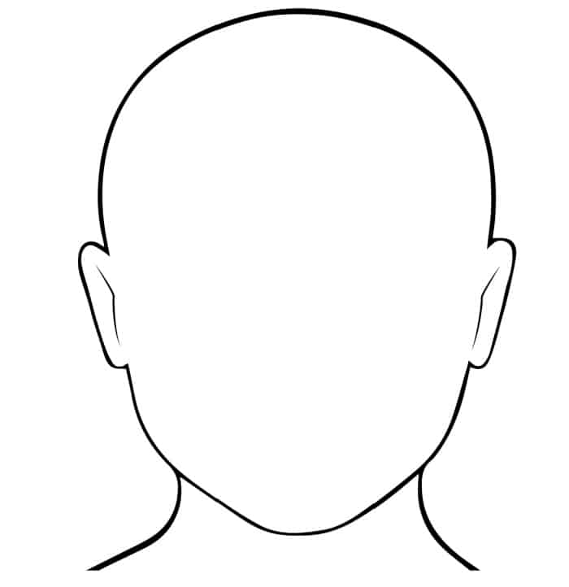
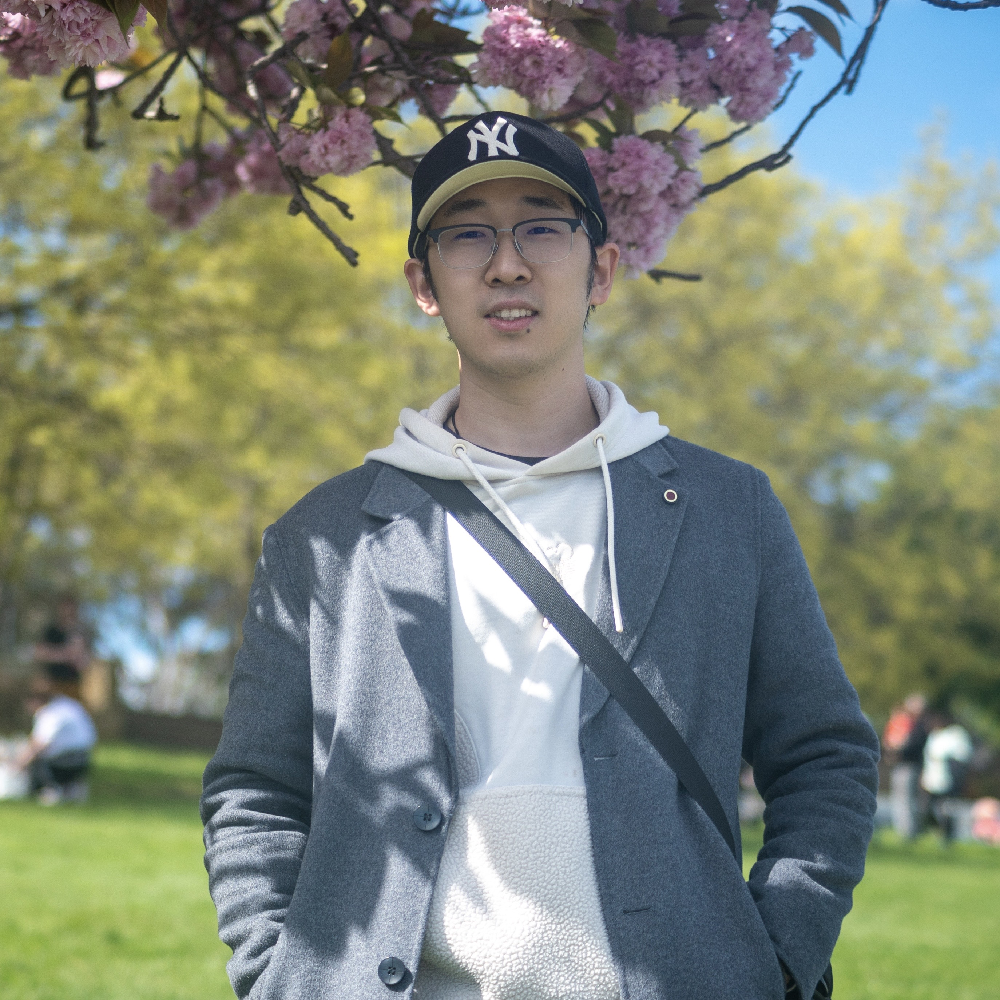
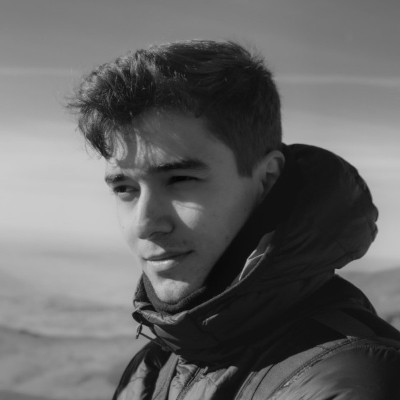

## Important dates

TODO:
<!-- - Paper submission deadline: March 16, 2025, 11:59 p.m. (Anywhere on Earth)
- Notification of acceptance: April 15, 2025
- Camera-ready submission: May 1, 11:59 p.m. (Anywhere on Earth)
- Workshop date: May 19, 2025 -->

# Context

Event-based cameras are bio-inspired visual sensors that mimic the transient pathway of the human visual system, offering
key advantages (e.g., microsecond temporal resolution and high dynamic range) that hold the potential to revolutionize robot
state estimation and image processing. Since the first commercially available event camera in 2008 and the first Workshop on
Event-based Vision at ICRA 2017, the community has witnessed a surge in event-based/-enhanced solutions for robotics and
computer vision. However, the community is facing a chicken-and-egg dilemma: on one hand, the high price of event cameras
stifles the community growth; on the other hand, the absence of large-scale deployment of event-based solutions discourages
mass production of these cameras. To this end, this workshop is dedicated to event-based vision, with a particular focus on its
development in state estimation and image processing.

 

This workshop builds on the tradition of inviting pioneering figures in the community as speakers, while also serving as a bridge between international/domestic start-ups and academia. It aims to promote discussions on identifying roadblocks that hinder progress in the field and foster collaborative solutions to overcome these barriers. Besides, the first-ever Event-based SLAM Challenge will be held in this workshop. This challenge seeks to benchmark state-of-the-art algorithms, encourage innovation in event-driven/-enhanced approaches, and push the boundaries of what is achievable in real-time ultra-frame-rate state estimation for high-speed robots. As a whole, this workshop will place a strong emphasis on the reproducibility of research findings in real-world scenarios and their tangible impact on advancing robotics technology

 

<!-- All invited speakers are confirmed. -->
# Program

| **Time**             | **Speaker**                     | **Topic/title**                                                                 |
|----------------------|---------------------------------|---------------------------------------------------------------------------------|
| 8:30am-8:40am        | Organizers                     | Welcome talk - Intro of workshop                                                 |
| 8:40am-8:55am        | SynSense                       | Industry Talk                                                                   |
| 8:55am-9:10am        | Dvsense                        | Industry Talk                                                                   |
| 9:10am-9:30am        | -                              | Mobile robot state estimation based on event camera                             |
| 9:30am-9:50am        | -                              | Mobile robot state estimation based on event camera                             |
| 9:50am-10:10am       | Jinshan Pan                    | Event-Based Imaging: Advancements in Enhancing Visual Perception under Challenging Conditions |
| 10:10am-10:30am      | Kuk-Jin Yoon                   | Multi-Modal Fusion in Computer Vision: Leveraging Event Data for Enhanced Object Detection and Scene Understanding |
| 10:30am-10:50am      | Yu Lei                         | Integrating Asynchronous Event Data with New Deep Learning Models: Challenges, Techniques, and Future Directions |
| 10:50am-11:10am      | -                              | Tea Break                                                                       |
| 11:10am-11:20am      | Organizers                     | Intro of Event-based SLAM Challenge: background, setup                         |
| 11:20am-11:30am      | Organizers                     | Awards Ceremony                                                                 |
| 11:30am-11:50am      | Winner                         | Event SLAM Challenge Winner Presentation                                       |
| 11:50am-12:30pm      | Panelists                      | Panel Discussion - TBD                                                          |
| 12:30pm              | -                              | End                                                                             |

**Note**: All times are in the local time zone of IROS 2025 (Beijing).

# Speakers  
<!-- copy paste this for each speaker

    

    
    

      

        <h3>Title of presentation</h3>
        <strong>Name</strong> 
        <em>Affiliation</em>   
        <a href="">Personal website</a>
      

 
end speaker1-->

    

    
    

      

        <h3>Event-Based Imaging: Advancements in Enhancing Visual Perception under Challenging Conditions</h3>
        <strong>Jinshan Pan</strong> 
        <em> Nanjing University of Science and Technology</em>   
        <a href="xxx/">Personal website</a>
      

 

# Competition

TODO

<!-- This year, the field robotics workshop features multiple competition tracks designed to address key challenges in field robot deployment.
The competition focuses on vision-based tasks of 2D and 3D Semantic Segmentation in challenging environments like dense vegetation. 
Participants have access to extensive datasets, including recordings from wheeled, tracked, and multi-legged robots navigating challenging off-road terrains from the [GOOSE](https://goose-dataset.de/) and [GOOSE-Ex](https://arxiv.org/pdf/2409.18788) dataset. 

The top-performing teams are invited to present their results during the workshop poster sessions and receive prizes.
The competitions are open to all field robotics researchers and practitioners.

Please visit the competition websites for more details:

**Vision Tracks:**
 - [GOOSE 2D Semantic Segmentation Challenge](https://tinyurl.com/goose-2d-challenge)
 - [GOOSE 3D Semantic Segmentation Challenge](https://tinyurl.com/goose-3d-challenge)

Any questions about the competition can be directed at [field-robotics-competition-icra-25@googlegroups.com](mailto:field-robotics-competition-icra-25@googlegroups.com?subject=Question%20regarding%20the%20Field%20Robotics%20Dataset%20Competitions). -->

# Organizers

    

    
    

      

        <strong>Yi Zhou</strong> 
        <em>Hunan University</em> 
        <a href="mailto:eeyzhou@hnu.edu.cn">eeyzhou@hnu.edu.cn</a> 
        <a href="https://sites.google.com/view/zhouyi-joey">Personal website</a>
      

 

    

    
    

      

        <strong>Jianhao Jiao</strong> 
        <em>University College London</em> 
        <a href="mailto:ucacjji@ucl.ac.uk">ucacjji@ucl.ac.uk</a> 
        <a href="https://gogojjh.github.io">Personal website</a>
      

 

    

    
    

      

        <strong>Yifu Wang</strong> 
        <em>Tencent IEG</em> 
        <a href="mailto:1fwang927@gmail.com">1fwang927@gmail.com</a> 
        <a href="https://1fwang.github.io">Personal website</a>
      

 

    

    
    

      

        <strong>Boxin Shi</strong> 
        <em>Peking University</em> 
        <a href="mailto:shiboxin@pku.edu.cn">shiboxin@pku.edu.cn</a> 
        <a href="https://camera.pku.edu.cn">Personal website</a>
      

 

    

    
    

      

        <strong>Liyuan Pan</strong> 
        <em>Beijing Institute of Technology</em> 
        <a href="mailto:Liyuan.Pan@bit.edu.cn">Liyuan.Pan@bit.edu.cn</a> 
        <a href="https://bitsslab.github.io/">Personal website</a>
      

 

    

    
    

      

        <strong>Laurent Kneip</strong> 
        <em>ShanghaiTech University</em> 
        <a href="https://mpl.sist.shanghaitech.edu.cn/">Personal website</a>
      

 

    

    
    

      

        <strong>Richard Hartley</strong> 
        <em>Australian National University</em> 
        <a href="mailto:Richard.Hartley@anu.edu.au">Richard.Hartley@anu.edu.au</a> 
        <a href="https://comp.anu.edu.au/people/richard-hartley/">Personal website</a>
      

<!-- ## Competition Organizers

  <table style="margin: 0 auto; border-collapse: collapse; border: none; cellpadding: 0; cellspacing: 0;">
    <tr>
      <td style="width: 80px; vertical-align: top; height: 120px; border: none;">
         <strong>Jan Faigl</strong>
      </td>
      <td style="width: 80px; vertical-align: top; height: 120px; border: none;">
         <strong>Gerald Steinbauer-Wagner</strong>
      </td>
      <td style="width: 80px; vertical-align: top; height: 120px; border: none;">
         <strong>Miloš Prágr</strong>
      </td>
      <td style="width: 80px; vertical-align: top; height: 120px; border: none;">
         <strong>Raphael Hagmanns</strong>
      </td>
    </tr>
    <tr>
      <td style="width: 80px; vertical-align: top; height: 120px; border: none;">
         <strong>Miguel Granero</strong>
      </td>
      <td style="width: 80px; vertical-align: top; height: 120px; border: none;">
         <strong>Vladimír Kubelka</strong>
      </td>
      <td style="width: 80px; vertical-align: top; height: 120px; border: none;">
         <strong>Peter Mortimer</strong>
      </td>
    </tr>
  </table>

 -->

<!-- # Call for papers

The workshop topics include, but are not limited to:

- Agriculture
- Construction
- Forestry
- Healthcare
- Intelligent Transportation Systems
- Marine Robotics
- Mining
- Search and rescue
- Space exploration

## Submission guidelines

FR workshop accepts contributions based on the following criteria:

- The submission should be from 2 to 8 pages long. The paper should follow the [IEEE RAS template](http://ras.papercept.net/conferences/support/tex.php).
- The review process is single-blind.
- Submissions should contain a clear focus on field robotics and feature lessons learned and/or field experience reports.
- We welcome prospective and conceptual papers as well.
- The papers should be submitted on [Microsoft CMT](https://cmt3.research.microsoft.com/FRICRA2025).
- Accepted papers will be available on the workshop website. The authors of accepted papers will be invited to present their results in a poster session during the workshop. -->